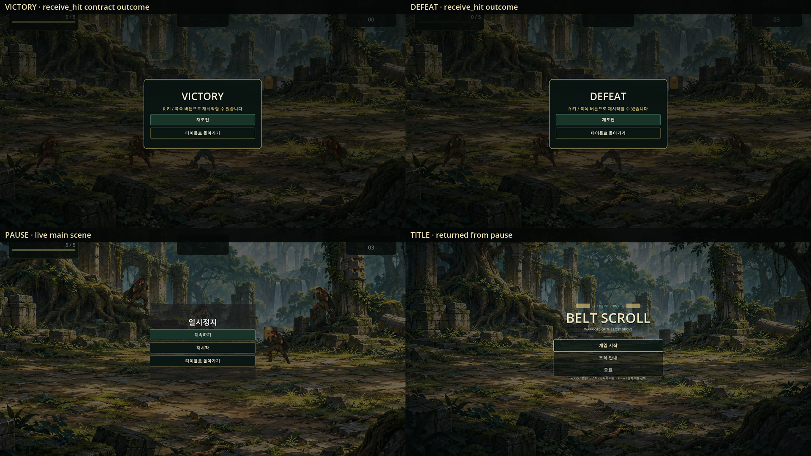

# Gameplay Endings Window Gate

## 결과

2026-10-09 Windows Godot 4.7.2 Compatibility renderer에서 통과했습니다. 전용 `gameplay_endings_window_smoke`는 bounded Window runner 안에서 한 Godot 프로세스로 캡처와 검증을 함께 실행합니다. suite 진입점은 `tools/smoke_suite.cmd`입니다.

비교판의 각 칸은 실제 Window Viewport가 `RenderingServer.frame_post_draw` 이후 제공한 1920×1080 프레임입니다. 공유용 비교판에서 각 프레임을 960×540으로 축소했습니다.

## 상태 재현과 의미

- `main.tscn`을 PackedScene으로 정상 인스턴스화하고 Player, CombatHUD, CombatAudio, Forest Ruins, Raider 세 명, 카메라와 YSort를 확인합니다.
- 리뷰 구도를 위해 전투 결과를 내기 전 캐릭터의 위치만 화면 아래쪽으로 재배치합니다. 결과 상태 변수는 직접 대입하지 않습니다.
- VICTORY는 Raider 세 명 각각에 기존 `receive_hit` 계약을 호출한 뒤 게임 세션이 정상 평가하도록 만듭니다. 이 캡처는 계약 경로로 만든 승리 상태이며 실시간 전투 승리라고 주장하지 않습니다.
- DEFEAT는 재시작된 정상 세션에서 Player의 `receive_hit` 호출 뒤 세션이 평가하도록 만듭니다.
- VICTORY와 DEFEAT 각각에서 재도전 버튼으로 씬을 재시작하고, 실행 중인 CombatAudio와 낮춘 time scale이 복원되는지 확인합니다.
- ESC로 PAUSE를 열고 키보드 방향키와 합성 D-pad로 메뉴 포커스를 이동합니다. 포커스된 타이틀 버튼의 실제 `pressed` 신호를 실행해 타이틀에 돌아가며 paused, time scale, CombatAudio 정지를 확인합니다.

## 실패 판정

Gate는 빈 프레임 또는 비정상 크기, 잘린 텍스처 경계, 화면 밖/숨겨진 캐릭터, 프레임에서 픽셀이 확인되지 않는 Player나 Raider, HUD 패널 픽셀 누락, 숨겨지거나 픽셀이 없는 버튼, 서로 겹치는 버튼, 화면 밖 버튼, 잘못된 포커스, 재시작·타이틀 전환 뒤 남은 paused/time scale/CombatAudio 상태를 실패 처리합니다.

`smoke_suite.cmd`는 이 테스트의 `APPDATA`만 `%TEMP%\BeltScrollGodotSmokeUserData`로 지정해 Godot 로그와 Compatibility shader cache의 머신별 쓰기 문제를 격리하고, 실행 뒤 원래 값을 복원합니다. 프로젝트 설정과 게임 로직은 변경하지 않습니다.
