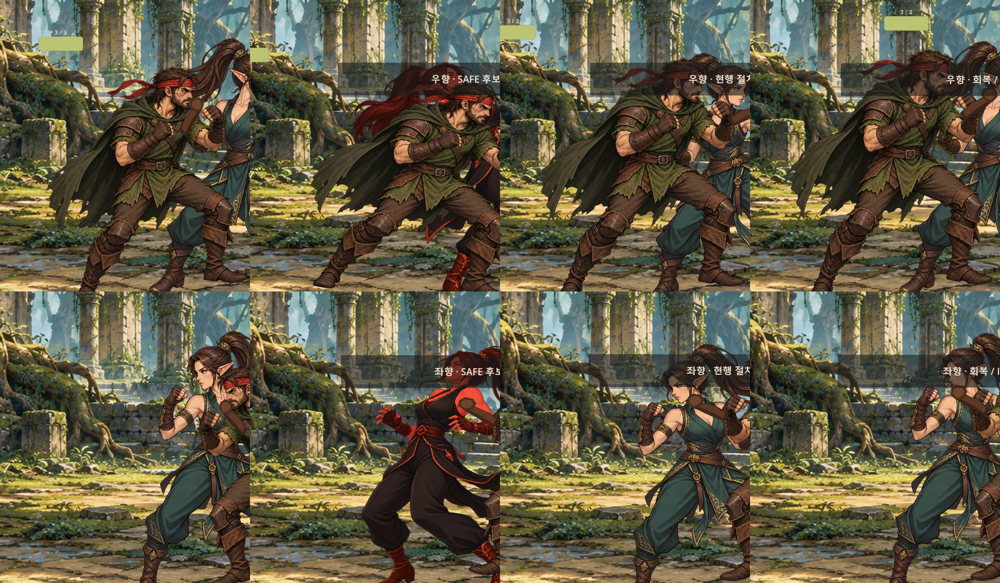

# Player 피격 동작 Window 격리 검수

## 실행 방식

본편 `scenes/game/main.tscn`을 실제 Window로 실행하고, 본편 Player와 ForestRaider를 사용했습니다. ForestRaider의 AI windup → active, 실제 AttackArea overlap → `Player.receive_hit` 경로에서 health 감소와 `player_hit` 신호를 확인했습니다. 방향마다 idle, safe 후보를 임시로 표시한 실제 hit 순간, 원래 텍스처를 복원한 procedural hit, hitstun/knockback 이후 idle 회복을 캡처했습니다. 각 패널은 `RenderingServer.frame_post_draw` 뒤의 Window viewport 이미지입니다.

safe 텍스처는 캡처 스크립트의 로컬 Sprite2D에 그 순간만 대입하고 즉시 복원합니다. Player, animation bank, manifest, allowlist에는 등록하지 않았습니다. 이는 safe 원화의 실제 hit 애니메이션 승인 또는 통합을 뜻하지 않습니다.

## 캡처 스트립

두 행은 우향과 좌향입니다. 각 행은 idle before → safe candidate / real hit → current procedural / real hit → recovery / idle 순서입니다. 런타임 공격 단계와 경직 시간은 본편 상태 전이를 사용했습니다.

## 관찰 항목

- safe 게이트의 측정값: 후보 하단 alpha anchor y=1253→1147, 공통 192px 기준 약 −16.23px 이동. 실제 본편 표시에서는 idle 기준과 발 접지 차이를 육안 확인해야 합니다.
- 크기 비교 수치: safe alpha 높이 1042/1254px, idle 1074/1254px로 safe가 32 asset px, 약 4.90/192px(2.98%) 짧습니다. 캡처에서는 큰 크기 팝은 없지만 후보가 약간 작고 하단 anchor가 올라가 발이 뜰 위험이 보입니다.
- 얼굴·귀·복장 연속성, 두 발 지지와 접지 여부는 캡처에서 사람이 검토합니다. 스크립트는 자동 승인하지 않습니다.
- 1차 캡처 육안 관찰: safe 후보의 검정·적색 의상과 idle의 청록·녹색 복장 사이에 큰 차이가 보입니다. 얼굴·귀 세부 연속성은 패널에서 추가 판정이 필요하며, 후보의 연속성은 승인되지 않았습니다.
- 크기 팝은 후보/절차 표현과 idle의 실루엣 크기를 비교해 사람이 확인합니다. 절차 표현의 실제 변형은 PlayerVisualAnimator가 계산합니다.
- hit-stop 확인: ForestRaider가 Player를 때리는 수신 피격은 Player 공격의 hit-stop 발동 경로를 호출하지 않아야 합니다. 해당 구간의 `_hit_stop_active`/time scale을 기록합니다. 시각적 프레임 정지는 캡처에서 별도로 확인합니다.

## 측정 기록

- safe 후보 표시 크기/anchor 산정의 기준은 기존 `player_hit_reaction_safe_gate.md`의 1254px asset → 192px game canvas입니다. 후보는 IDLE와 동일한 Sprite2D transform을 사용해 런타임의 위치 변화를 가리지 않습니다.
- 우향 · IDLE 캡처: Window post-draw, player_center=(960.0, 945.501), health=5, hitstun=0.000, velocity=(0.0, 0.0), animation=idle, texture=res://assets/art/player/elven_fighter_reference_v8_clean_candidate_1254x1254.png
- 우향 ForestRaider windup: physics_frame=31
- 우향 · SAFE 후보 / 피격 캡처: Window post-draw, player_center=(963.6295, 946.9811), health=4, hitstun=0.293, velocity=(129.9998, -0.202335), animation=hit, texture=res://assets/art/player/elven_fighter_hit_reaction_v1_safe_candidate_1254x1254.png
- 우향 · 현행 절차 피격 캡처: Window post-draw, player_center=(963.2906, 947.9655), health=4, hitstun=0.160, velocity=(9.999976, -0.015564), animation=hit, texture=res://assets/art/player/elven_fighter_reference_v8_clean_candidate_1254x1254.png
- 우향 receive_hit 시점 hit-stop 관찰: active=false, time_scale=1.00, 첫 Window 캡처까지=1848ms
- 우향 · 회복 / IDLE 캡처: Window post-draw, player_center=(960.197, 947.9655), health=4, hitstun=0.000, velocity=(0.0, 0.0), animation=idle, texture=res://assets/art/player/elven_fighter_reference_v8_clean_candidate_1254x1254.png
- 좌향 · IDLE 캡처: Window post-draw, player_center=(960.0, 948.0001), health=5, hitstun=0.000, velocity=(0.0, 0.0), animation=idle, texture=res://assets/art/player/elven_fighter_reference_v8_clean_candidate_1254x1254.png
- 좌향 ForestRaider windup: physics_frame=92
- 좌향 · SAFE 후보 / 피격 캡처: Window post-draw, player_center=(955.6442, 946.9785), health=4, hitstun=0.277, velocity=(-114.9999, -0.171003), animation=hit, texture=res://assets/art/player/elven_fighter_hit_reaction_v1_safe_candidate_1254x1254.png
- 좌향 · 현행 절차 피격 캡처: Window post-draw, player_center=(956.9875, 947.967), health=4, hitstun=0.160, velocity=(-9.999989, -0.01487), animation=hit, texture=res://assets/art/player/elven_fighter_reference_v8_clean_candidate_1254x1254.png
- 좌향 receive_hit 시점 hit-stop 관찰: active=false, time_scale=1.00, 첫 Window 캡처까지=3081ms
- 좌향 · 회복 / IDLE 캡처: Window post-draw, player_center=(959.7718, 947.967), health=4, hitstun=0.000, velocity=(0.0, 0.0), animation=idle, texture=res://assets/art/player/elven_fighter_reference_v8_clean_candidate_1254x1254.png

## 결과

- 자동 통합 게이트: PASS
- 사람 검토: 얼굴·귀·복장 연속성, 양발 접지, 크기 팝, 반동 판독은 캡처 확인이 필요합니다.
- 판정 범위: safe 원화는 검수 후보이며, 승인된 전용 hit 애니메이션이 아닙니다. manifest와 allowlist를 변경하지 않았습니다.
