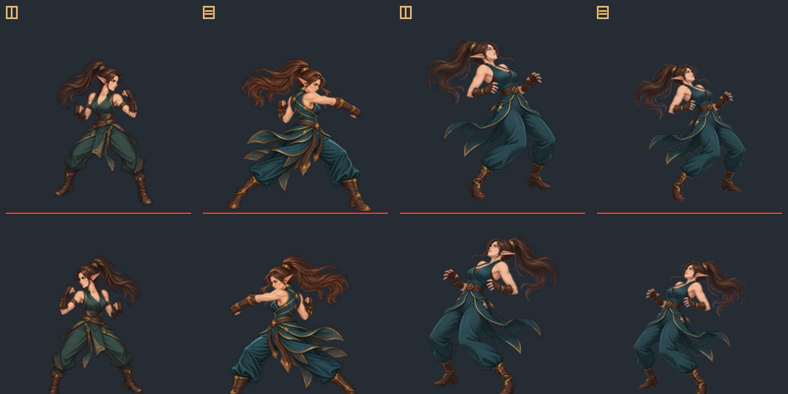

# Hit reaction safe gate — WORK 100

## 상태: safe 후보 준비 완료 · 사람 승인 대기

새 피격 원화 `assets/art/player/elven_fighter_hit_reaction_v1_candidate_1254x1254.png`가 실제로 확보되어 원본 바이트를 보존했다. 이를 기반으로 별도 safe 후보 `assets/art/player/elven_fighter_hit_reaction_v1_safe_candidate_1254x1254.png`를 생성했다. 후보는 1254×1254 RGBA8, alpha 여백 L/T/R/B=96/106/99/106px, 8방향 고립 alpha 픽셀 0개다.

## 현행 피격 표시

`player_visual_animator.gd`는 hit 상태에 승인된 원화가 없으면 `temporary procedural hit; approved frames unavailable` 표현을 유지한다. 플레이어 본체에 0.12초 플래시를 주고 hit 상태에서 전신 sprite를 회전·스케일 변형한다. 새 원화는 본편에 연결하지 않았으므로 런타임은 계속 기존 표현을 쓴다.

## 비교 보드

패널 순서는 **1** v8 idle safe, **2** attack2 contact v6 safe, **3** hit 원본, **4** hit safe 후보다. 위 행은 우향, 아래 행은 좌우 미러다. 모든 패널은 같은 1254→192 비율의 192×192 게임 캔버스에 정렬하고 3배 nearest-neighbor로 확대했다. 두 행 모두 발 밑 기준선을 표시한다.

| 검수 항목 | 측정 |
|---|---|
| v8 idle alpha bounds | (110, 90), 1034×1074 asset px; 약 158×164 game px |
| attack contact v6 safe alpha bounds | (119, 102), 1016×1050 asset px; 약 156×161 game px |
| contact와 idle 상대 높이 | contact는 24 asset px/3.68 game px 낮고, 원본 하단 anchor는 idle보다 12 asset px/1.84 game px 위쪽 |
| hit 원본 alpha bounds | (0, 41), 1236×1213 asset px |
| hit safe alpha bounds | (96, 106), 1059×1042 asset px; 여백 96/106/99/106px |
| hit safe 변환에 따른 anchor | 하단 y=1253→1147, delta −106 asset px/−16.23 game px; 중심 x delta +7.5 asset px/+1.15 game px |
| 얼굴·귀·복장 identity | 보드에서 idle, contact, 원본, safe의 얼굴·귀·복장을 사람이 비교·승인해야 함 |
| 상체 후방 반동 | 원화는 상체를 뒤로 젖힌 형태. 접촉 포즈·idle과 비교해 읽힘과 반동 강도를 사람이 판단해야 함 |
| 양발 지지 | 두 발의 지면 접촉과 무게 지지를 사람이 확인해야 함. 기준선은 공통이며, 새 원화의 실제 지지 여부는 자동 판정하지 않음 |
| 공격·달리기와 구별 | **사람 검토 필요**. 자동 승인하지 않음 |

safe 리사이즈가 원화의 높이와 발 anchor를 바꾼 값은 위에 기록했다. 게임 내 anchor와 애니메이션 전환을 검토한 뒤 별도 승인되기 전까지 본편, manifest, allowlist에 등록하지 않는다.
