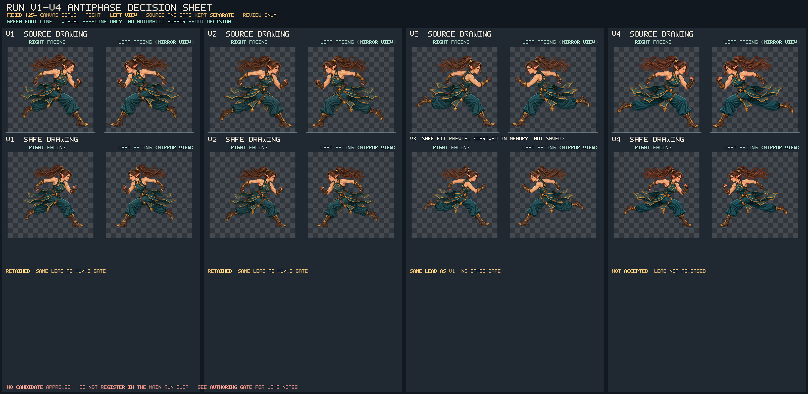

# Run v1~v4 반대 보폭 원화 제작 게이트

## 현재 판정

v1~v4 후보는 모두 **미수용** 상태다. 이전 v1/v2 동일 보폭·중복 포즈 판정과 v3 판정을 그대로 유지한다. 네 후보 모두 우향 기준 화면 오른쪽 다리가 전방, 화면 왼쪽 다리가 후방이며 전방 팔은 화면 오른쪽, 후방 팔은 화면 왼쪽이다. v1/v2 safe는 같은 오른쪽 전방 부츠가 지지발 후보였다는 기존 기록이 있다. v3는 지지발 후보를 지정하지 않았고, v4도 전방 부츠가 후보로만 보인다. 어느 것도 착지나 실제 체중 지지를 확정하지 않는다.



네 버전 각각의 위 행은 실제 원화, 아래 행은 safe다. 각 행은 1254×1254 캔버스 전체를 동일 크기로 표시하고 우향 및 좌향 보기를 나란히 둔다. 좌향은 읽기 비교용 미러 보기만 하며 반대 보폭 근거로 세지 않는다. v3는 저장된 safe가 없어서 원화 alpha bounds를 기존 90px inset fit 방식으로 메모리에서만 축소한 미저장 미리보기를 표시한다. 이는 원본 safe 파일이 아니며 입력 자산을 쓰지 않는다. 바닥선은 시각 가이드뿐이고 접촉 자동 판정이 아니다.

## 후보별 사람 관찰 기록

아래 방향은 캐릭터가 화면 오른쪽을 보는 원화 기준이다. **화면 전방/후방 다리**는 이동 방향의 좌우 위치이고, **가까운/먼 다리**는 몸통과 천 실루엣의 겹침으로 추정하는 깊이 관계다. 둘을 같은 속성으로 취급하지 않는다. 시트 아래 좌표는 각 1254 원화 캔버스에서 사람이 다시 짚을 수 있도록 기록한 대략적 픽셀 범위다. 자동 관절 검출 값이 아니며, 좌향은 해당 x좌표가 `1254 - x`로 반전된다.

| 후보 | 화면 다리 리드 | 가까운/먼 다리(겹침 관찰) | 팔 스윙 | 지지발 후보 | 골반 중심 및 발 위치(원화 픽셀, 대략) |
|---|---|---|---|---|---|
| v1 source + safe | 전방 다리=화면 오른쪽의 굽혀 앞으로 뻗은 다리. 후방 다리=왼쪽으로 길게 뻗은 다리. | 가까운 쪽으로 보이는 오른쪽 허벅지/정강이가 앞에 겹치며 전방; 먼 쪽으로 보이는 왼쪽 다리가 후방. 레이어가 천에 일부 가려져 확신도 중간. | 전방 팔=오른쪽 주먹을 앞으로; 후방 팔=왼쪽 팔꿈치와 주먹을 뒤로. | safe에서 오른쪽/전방 부츠 중심 약 `(1090,1200)` — 기존 수동 후보, 접촉 미확정. | 골반/허리띠 중심 약 `(700–770, 650–730)`; 후방 발 `(230–340, 930–1040)`; 전방 발 `(1080–1180, 1150–1220)`. |
| v2 source + safe | 전방 다리=화면 오른쪽의 앞으로 뻗은 다리. 후방 다리=왼쪽 뒤로 접힌 다리. v1과 리드 동일. | 가까운 쪽으로 보이는 오른쪽 다리가 전경, 먼 쪽 왼쪽 다리가 후경; 허리 천과 바지 주름이 무릎 경계를 가려 확신도 중간. | 전방 팔=오른쪽 주먹 앞으로; 후방 팔=왼쪽 주먹 뒤로. | safe에서 오른쪽/전방 부츠 중심 약 `(1168,1225)` — 기존 수동 후보, 접촉 미확정. | 골반/허리띠 중심 약 `(730–810, 680–760)`; 후방 발 `(170–270, 1020–1110)`; 전방 발 `(1120–1210, 1170–1235)`. |
| v3 source + 메모리 safe-fit 미리보기(미저장) | 전방 다리=화면 오른쪽; 후방 다리=화면 왼쪽으로 뻗음. 이전 v3 검수도 v1과 같은 앞발 리드로 기록했다. | 오른쪽 전방 다리가 겹침상 가까운 쪽, 왼쪽 후방 다리가 먼 쪽으로 읽힌다. 허리 천 꼬리와 바지 교차부 때문에 깊이 판정은 사람 재확인 필요. | 전방 팔=오른쪽 팔/주먹 앞으로; 후방 팔=왼쪽 팔 뒤로. | 미지정. 외곽 최저점으로 임의 지정하지 않는다. | 원화 골반/허리띠 중심 약 `(740–820, 690–780)`; 원화 후방 발 `(70–170, 980–1100)`; 전방 발 `(1130–1220, 1170–1235)`. 임시 safe는 여백 fit된 원화 복사본일 뿐 별도 safe 자산/승인 자료가 아니다. |
| v4 source + safe | 전방 다리=화면 오른쪽의 큰 전진 보폭; 후방 다리=왼쪽으로 길게 뻗음. 뒤 다리 길이는 늘었지만 전방 다리 방향이 바뀌지 않았다. | 오른쪽 허벅지/부츠가 가까운 전경, 왼쪽으로 뻗은 다리/부츠가 먼 후경으로 읽힌다. 골반에서 천과 허리띠가 교차하므로 관절 소속은 사람 확인 대상. | 전방 팔=오른쪽 주먹 앞으로; 후방 팔=왼쪽 팔 뒤로. | 오른쪽/전방 부츠만 화면상 후보. 자동 마커/접촉 판정 없음. | 골반/허리띠 중심 약 `(760–840, 700–790)`; 후방 발 `(50–160, 1080–1180)`; 전방 발 `(1100–1225, 1180–1245)`. |

좌표는 완성 원화에서 골반과 각 부츠를 표시할 때 시작할 범위다. 전방 부츠가 더 낮은 y값/높은 y값인지나 알파 경계만으로 지지발을 정하지 않는다. 자동 판정은 하지 않는다. 사람 검수에서 가려진 관절을 확인하고 최종 앵커를 고쳐 기록한다. safe는 원화 캔버스 안쪽 맞춤으로 실루엣이 작아질 수 있으므로 safe에서 점을 다시 표시할 때 동일 1254 좌표계에서 따로 확인한다.

## 다음 원화의 반대 보폭 요구

우향 한 장 기준으로 다음을 모두 눈으로 확인 가능한 형태로 그린다.

1. **가까운 다리: 후방.** 골반에서 시작한 가까운 쪽 허벅지와 무릎이 화면 왼쪽으로 이동하고, 같은 다리의 부츠도 몸통 골반 중심보다 화면 왼쪽에 놓인다. 무릎/부츠가 천에 묻혀 방향이 불명확하지 않게 다리 실루엣을 분리한다.
2. **먼 다리: 전방.** 먼 쪽 다리의 무릎과 부츠가 화면 오른쪽, 골반 중심보다 앞에 놓인다. 가까운 다리 뒤에 일부 가려져도 발끝과 정강이 방향이 전방임을 읽을 수 있게 한다.
3. **팔은 다리와 별도로 표시한다.** 골반 중심을 기준으로 전방/후방 팔을 각각 이름 붙이고 관절 소속을 보이게 한다. 달리기 카운터 스윙을 의도할 때 전방으로 나가는 다리와 반대쪽 팔이 앞으로, 같은 쪽 팔이 뒤로 가도록 한다. 좌우 신체명을 먼저 표기해 가림 때문에 잘못 짝짓지 않는다.
4. **골반 앵커를 고정해 발 관계를 비교한다.** 골반 중심, 가까운/먼 고관절 시작점, 무릎, 양쪽 발목 및 부츠 밑창 중심을 각각 표시한다. 발 두 점을 골반에 대한 좌우 위치로 기록하며, 단지 원화 전체를 옮겨 보폭이 바뀐 것처럼 만들지 않는다.
5. **지지 여부는 포즈 실루엣만으로 승인하지 않는다.** 부츠는 후보라고 기록할 수 있지만 접촉/체중 지지는 연속 프레임 또는 사람 애니메이션 검토에서 확인한다.

캐릭터가 화면 왼쪽을 보는 최종 비교에서는 위 화면 관계를 방향 기준에 맞춰 다시 표현하고 검수한다. 이미지 좌우를 한 번 미러하는 것만으로 새 반대 보폭을 만들거나 승인하지 않는다. 얼굴 방향, 포니테일 흐름, 의상 연결과 골반 정렬도 새 원화에서 유지되는지 별도 검수한다.

## 승인 게이트와 재생성

- 현재 v1~v4는 전방/후방 다리 리드가 기존과 같으므로 **미수용**. 어느 후보도 본편 `run` clip, Player 애니메이션 또는 manifest에 추가하지 않는다.
- 자동 지지발 추정, alpha 하단 중심, 발의 단순 x좌표, safe 축소, 좌우 미러는 보폭 승인 기준이 아니다.
- 새 그림 제출 시 사람 검수자가 표의 각 칸을 다시 채운다. 특히 가까운 다리=후방, 먼 다리=전방이 보이고 골반 기준 발 앵커가 분리될 때까지 수용하지 않는다.
- `v3` 저장 safe는 제공되지 않았다. 시트의 메모리 safe-fit 미리보기는 임시 축소 비교에만 쓰고 정식 safe 자산으로 취급하지 않는다.

시트 재생성:

```powershell
& 'C:\Project\Godot\godot.exe' --headless --path . --script res://tools/build_player_run_antiphase_decision_sheet.gd
```

재고와 비승인 불변 조건 점검:

```powershell
& 'C:\Project\Godot\godot.exe' --headless --path . --script res://tests/player_run_antiphase_decision_smoke.gd
```
