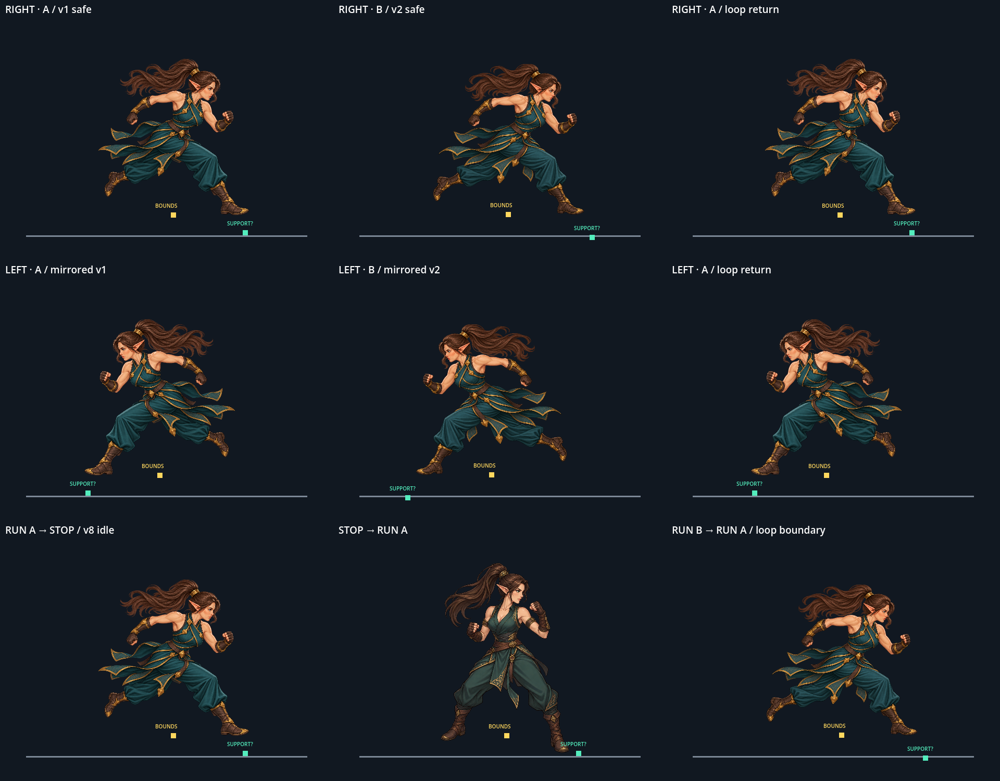

# Run v1·v2 Safe 보폭 독립 검수

## 판정

- **결론: 두 safe 원화는 반대 보폭이 아니다.** 둘 다 같은 달리기 포즈 계열로, 교대 프레임보다 **중복 포즈 위험**으로 분류한다.
- 후보는 기존 파일 `elven_fighter_run_stride_v1_safe_candidate_1254x1254.png`와 `elven_fighter_run_stride_v2_safe_candidate_1254x1254.png`다. 검수 중 두 원화는 변경하지 않았다.
- 승인 및 본편 `Player`/animation manifest 연결은 수행하지 않았다.

## 포즈 비교

화면을 향하는 좌우 방향은 판정 기준에서 제외하고, 인물 기준 좌우 다리와 팔의 앞뒤 관계를 비교했다.

| 관찰 항목 | v1 safe | v2 safe | 판정 |
|---|---|---|---|
| 다리 순서 | 인물의 오른쪽 다리가 전방으로 길게 뻗고, 왼쪽 다리는 뒤로 접혀 발끝이 들림 | 같은 오른쪽 전방 다리와 왼쪽 후방 킥 | 동일 |
| 골반/몸통 | 골반이 전방으로 기울어진 달리기 자세 | 같은 방향의 전방 기울기. 장식과 천 주름은 달라도 골반 회전이 반대로 바뀌지 않음 | 동일 포즈 계열 |
| 팔 교차 | 인물의 왼팔/주먹은 앞, 오른팔은 뒤로 구동 | 같은 왼팔 전방·오른팔 후방 배치 | 동일 |
| 지지 후보 | 오른쪽 앞 부츠가 지지 후보 | 오른쪽 앞 부츠가 지지 후보 | 같은 다리 지지 |

따라서 두 이미지를 A/B로 번갈아 보여도 지지 다리가 바뀌는 한 걸음은 만들어지지 않는다. 크롭·의상 주름·장식 위치 차이는 포즈 교대를 대신하지 못한다.

## 실제 Godot Window 관찰

도구는 실제 표시 가능한 1920×1080 Godot Window에서 post-draw 화면을 캡처했다. 1920×1500 증거 스트립은 3×3 패널로 우향 A→B→A, 좌향 A→B→A, run A→정지, 정지→run A, B→A 루프 경계를 담는다. 각 패널은 약 140–180ms 대기 후 실제 Window에서 얻은 프레임이며 패널별 5–6회 렌더를 확인했다. 정지는 기존 v8 idle 원화로 표시했다.



| 측정 | v1 safe | v2 safe | 차이/관찰 |
|---|---:|---:|---|
| 원본 alpha bounds (alpha ≥ 5%) | 888×920 px | 886×887 px | 표시 폭은 거의 같고 v1이 더 높음 |
| 고정 배율 0.327 표시 경계 | 290.4×300.8 px | 289.7×290.0 px | A↔B 전환에서 alpha 높이 약 10.79px 변화 |
| 오른쪽 부츠 지지 후보 원화 좌표 | (1090,1200) | (1168,1225) | 두 후보 모두 같은 오른쪽 앞 부츠를 가리킴 |
| 같은 표시 배율에서 지지 후보 좌표 차 | — | — | 약 (+25.51, +8.18) 화면 px |

위 지지 좌표는 원화를 사람이 확인해 지정한 **후보**다. 물리 접촉을 자동 측정한 값이 아니므로 실제 발 미끄러짐을 단정하지 않는다. 다만 두 포즈를 같은 중심/배율로 바로 교대하면 지지 후보가 약 8.18px 위아래로 어긋나고 25.51px 좌우로 이동한다. 접지 기준점을 맞춰 위치 보정하면 발 위치를 숨길 수는 있어도 반대 보폭은 생기지 않는다.

실제 캡처에서는 A→B와 B→A가 다른 중간 포즈 없이 이미지 교체로 나타나며, 실루엣 높이 차이와 부츠 후보 위치 이동이 프레임 팝/발 미끄러짐 의심 지점이다. idle과 run의 고정 배율 alpha 높이 차이는 약 63.76px이다. 전환 캡처는 원화 자체를 교체해 보는 격리 미리보기라서 보간·게임플레이 이동 속도·충돌 접지를 검증하지 않는다.

## 재현과 범위

프로젝트 루트에서 다음을 실행하면 Window 캡처 스트립이 생성된다.

```powershell
& 'C:\Project\Godot\godot.exe' --path . --script res://tools/review_player_run_stride_opposition.gd
```

기계 확인은 `tests/player_run_stride_opposition_smoke.gd`에 둔다. 이 검수는 기존 safe 원화의 포즈 관계와 실제 Window 표시를 기록하는 독립 자료다. 승인, 후보 원화 수정, 본편 연결, manifest 등록은 포함하지 않는다.
