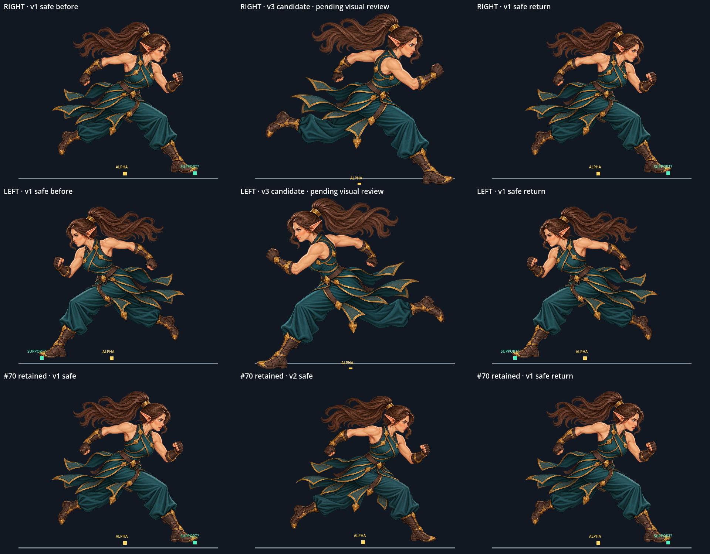

# Run v3 반대 보폭 확보 게이트

## 판정

- **v3 후보 확보, 승인 보류.** `elven_fighter_run_stride_v3_left_lead_candidate_1254x1254.png`가 존재한다. 이전 “미확보” 기록은 갱신되었다. 실제 Window 캡처에서 v1 safe → v3 후보 → v1 safe를 우향과 좌향으로 배치했다.
- #70의 기존 **v1/v2 동일 보폭·중복 포즈 위험** 판정을 그대로 보존한다. 둘 다 인물 기준 오른쪽 다리가 앞, 왼쪽 다리가 뒤로 접혀 있고 왼팔은 앞, 오른팔은 뒤로 구동한다. 같은 오른쪽 앞 부츠가 지지 후보다.
- 이 게이트는 기계 검수이며 승인하지 않는다. 후보 수정이나 본편 `Player`/animation manifest 연결은 하지 않았다.

## 실제 Window 증거



스트립은 1920×1080 windowed Godot Window에서 각 상태를 post-draw 한 뒤 캡처했다. 표시 배율은 `scenes/player/player.tscn`의 실제 PlayerArt 배율 `0.4469274`를 썼다. 아래 행에는 기존 v1 safe → v2 safe → v1 safe를 두어 #70의 중복 판정을 보존했다. 민트 표식은 사람이 지정한 지지발 **후보**이며, 노란 표식은 alpha 하단 경계의 참고점이다. 둘 다 실제 접촉을 자동 판정하지 않는다.

캡처에서 v3는 v1과 같은 앞발 리드(인물의 앞다리와 같은 쪽 부츠가 앞, 반대 다리가 뒤로 접힘)로 보인다. 팔 교차도 v1과 같은 방향이라 반대 보폭 근거가 부족하며 수용하지 않는다. 우향 전환 후 좌향 단일 미러에서도 지지 후보가 교대되지 않는다. PlayerArt 동일 축척의 alpha 외곽은 v1 `396.9×411.2px`, v3 `509.5×464.8px`다. alpha 하단 중심을 캔버스 기준점으로 비교하면 v1 `(667,1096)`, v3 `(654,1164)`, 이동량 `(-13,+68)` 원화 px, 표시상 `(-5.8,+30.4)` 게임 px다. 이 alpha 경계 측정치는 발목/골반 의미 앵커가 아니며, v3 지지발 자체는 별도 수동 후보 지정 전이라 미판정이다. 루프 경계 팝과 양쪽 원화 사이 골반·포니테일 정렬도 미판정이다. #70의 v1/v2 관찰은 계속 유효하다. 두 safe 모두 오른쪽 앞 부츠 지지 후보여서 교대 보폭으로 수용할 근거가 없다. v3 후보는 승인되지 않았고 본편에 연결하지 않았다.

## 재현

프로젝트 루트에서 실제 표시 가능한 데스크톱 세션으로 실행한다.

```powershell
& 'C:\Project\Godot\godot.exe' --path . --script res://tools/review_player_run_v3_antiphase.gd
```

스모크는 v3 미확보 상태와 기존 중복 판정 및 PNG 산출물을 검사한다.

```powershell
& 'C:\Project\Godot\godot.exe' --headless --path . --script res://tests/player_run_v3_antiphase_smoke.gd
```
