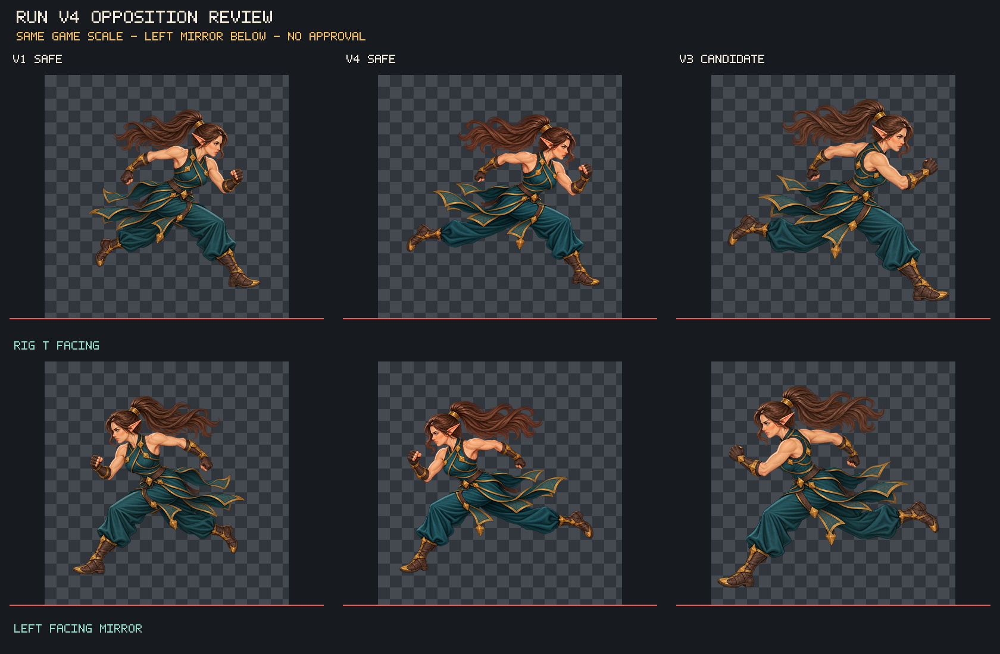

# v4 반대 보폭 검수 게이트

## 판정

- v4 원본 `elven_fighter_run_stride_v4_opposite_contact_candidate_1254x1254.png`를 확보해 별도 safe를 제작했다. 원본 SHA-256은 `d3248a8c24cdf11379f7074bcaa6cda4adbf2ccb30fbbe92f92a066765a9bb40`이며 준비 중 원본 바이트가 보존됐다. Safe는 1254×1254 RGBA8, 유효 alpha 외곽 사방 여백 L/T/R/B=`102/146/102/106px`, 고립 alpha 픽셀 `0개`다.
- v1~v3의 이전 **동일 보폭** 판정을 보존한다. v1 safe, v2 safe, v3 후보 모두 인물의 전방 다리(우향 기준 화면 오른쪽)가 앞서고 후방 다리(화면 왼쪽)가 뒤로 뻗는다. 팔 스윙도 전방 팔은 앞, 반대 팔은 뒤로 가는 같은 방향이다. 지지발 후보도 모두 전방 부츠 쪽이다.
- v4도 전방 다리가 앞서고 후방 다리가 뒤로 뻗으며, 전방 팔이 앞으로 뻗고 후방 팔이 뒤로 구동한다. 앞/뒤 다리 리드, 팔 스윙, 지지발 후보가 v1과 뒤바뀌지 않아 **명확한 반대 보폭이 아니다. 미수용**으로 기록한다.
- 비교판은 v1 safe, v4 safe, v3 후보를 1254×1254 캔버스의 같은 게임 표시 배율로 배치하고, 같은 이미지들을 좌향 미러로 보여준다. v4의 포니테일은 뒤로 흐르며 머리와 연결되고 골반 천/허리띠 형태도 끊겨 보이지 않는다. 다만 단일 포즈만으로 프레임 사이 연결 연속성을 판정할 수 없고, v4의 골반 및 꼬리 크기·배치가 v1과 달라 정확한 관절 앵커 일치 여부는 별도 키포즈 자료 없이 확정하지 않는다.
- 민트/접촉 마커는 만들지 않았다. 정지 이미지 한 장만으로 지면 접촉을 확정할 수 없으며, 현재는 보이는 부츠 배치상 전방 부츠가 지지 후보로 남아 보폭 교대 근거가 없다.
- 후보를 승인하지 않았고 Player/animation manifest 등 본편에 등록하지 않았다.

## 비교 이미지



위 행은 우향 원화, 아래 행은 동일 원화의 좌우 반전이다. v4는 뒤쪽 다리를 더 길게 뻗었지만 앞선 다리의 방향과 팔 스윙 방향은 v1과 동일하다. 포니테일과 골반 실루엣은 캔버스상 함께 비교했으며, 정지 포즈 비교만으로 애니메이션 연결을 승인하지 않는다.

## 재현

프로젝트 루트에서 실행:

```powershell
& 'C:\Project\Godot\godot.exe' --headless --path . --script res://tools/prepare_player_run_v4_safe.gd
& 'C:\Project\Godot\godot.exe' --headless --path . --script res://tests/player_run_v4_safe_smoke.gd
```

검수 도구는 원본 바이트를 확인한 뒤 별도 safe를 생성하고 비교판을 갱신한다. 자동 승인이나 본편 연결은 수행하지 않는다.
